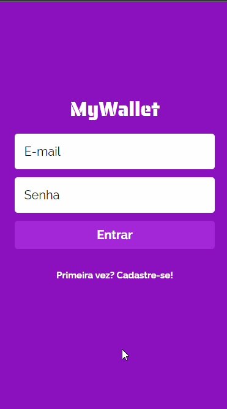

# My Wallet

A mobile app designed to help tracking revenues and expenses. Have a better knowledge on how you are spending your money.



## About

My Wallet is a web aplication in which people can insert their income and expenditure. The implemented features are:

- Sign Up
- Login
- List all financial entries from the user
- Add and edit expense
- Add and edit revenue

## Techs

The following tools and frameworks were used in the development of the project: <br>

   

## How to run

1. Clone this repository

```bash
git clone https://github.com/yugosk/mywallet-front.git
```

2. Clone the back-end repository at https://github.com/yugosk/mywallet-back
3. Follow instructions to run back-end at https://github.com/yugosk/mywallet-back
4. Install dependencies

```bash
npm i
```

5. Run the front-end with

```bash
npm start
```

6. Optionally, you can build the project with

```bash
npm run build
```

7. Then, access http://localhost:3000 on your browser to use the app.
